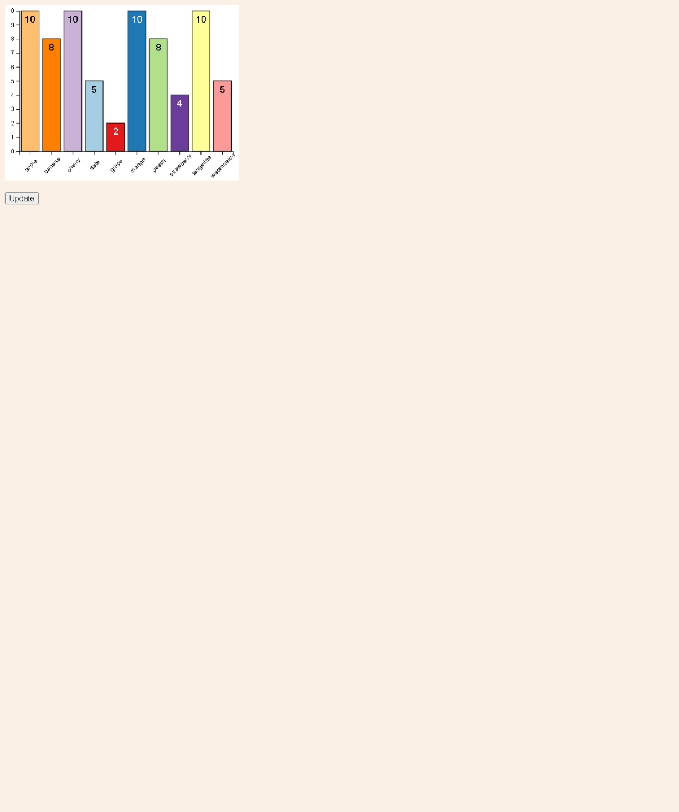

# Learning the basics of d3.js barCharts for displaying data.

## This project is a skelton this was part of a master the basics course.

## Feel free to take and use this code if needed every function has good comments if your also new to d3.js

### this project is for quick access to the d3.js library and how to use it.

# 
